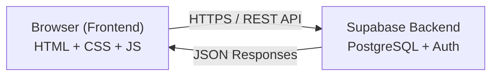
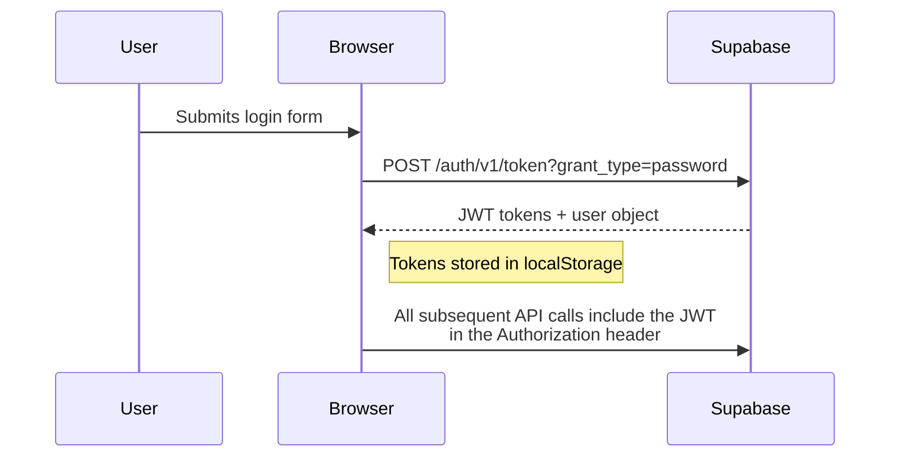
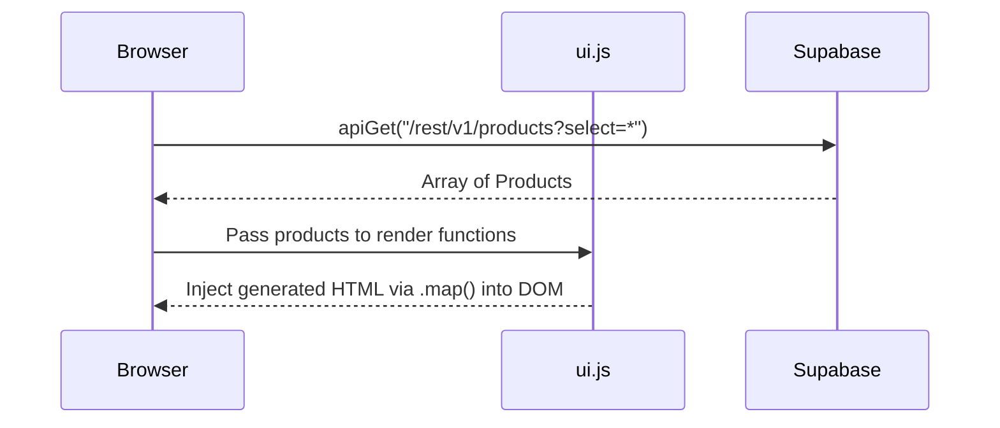
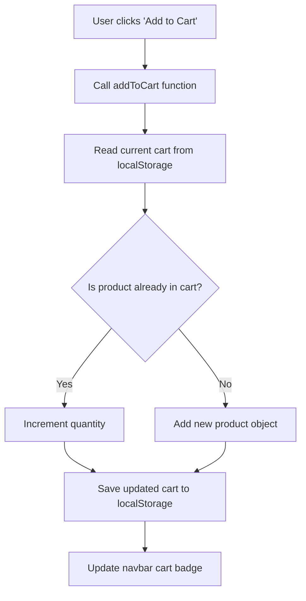
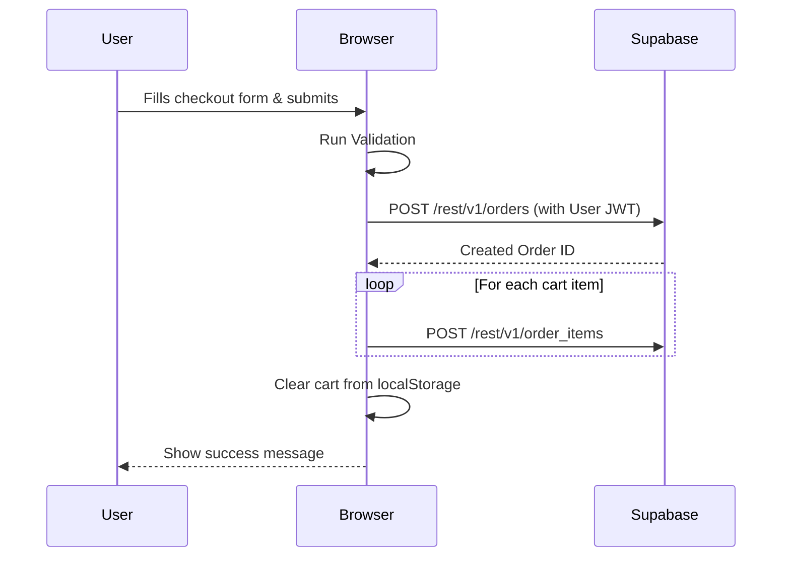
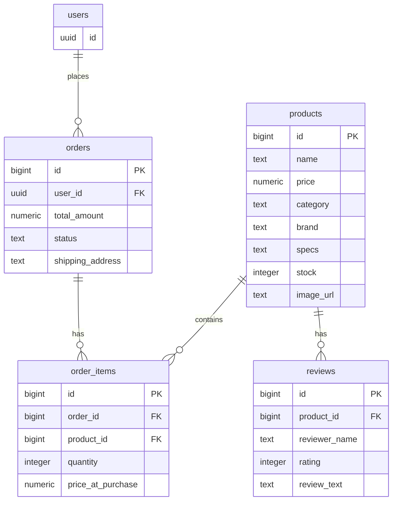

# Architecture

An overview of how byteStore is built, how the pieces connect, and how data flows through the application.

---

## How It Works (The Big Picture)



**byteStore is a client-side application.** All the code runs in the user's browser. There is no custom server — the app talks directly to Supabase's REST API using the browser's built-in `fetch()` function.

This means:

- **No build step** — open `index.html` and it works
- **No Node.js server** — Supabase handles the database and authentication
- **No frontend framework** — everything is vanilla HTML, CSS, and JavaScript

---

## Tech Stack Breakdown

| Layer              | Technology                | Role                                                   |
| ------------------ | ------------------------- | ------------------------------------------------------ |
| **Structure**      | HTML5                     | Page layout and semantic content                       |
| **Styling**        | Tailwind CSS (CDN)        | Utility classes for layout, spacing, responsive design |
| **Components**     | Franken UI                | Pre-styled UI elements (buttons, cards, modals, etc.)  |
| **Icons**          | Lucide Icons              | SVG icon library                                       |
| **Logic**          | Vanilla JavaScript (ES6+) | All interactivity, API calls, DOM updates              |
| **Database**       | Supabase (PostgreSQL)     | Product catalog, orders, reviews                       |
| **Auth**           | Supabase Auth             | User registration and login                            |
| **Storage**        | Supabase Storage          | Product images uploaded by admin                       |
| **Client Storage** | localStorage              | Cart data and user session tokens                      |

---

## JavaScript Modules

The app's logic is split into focused files, each handling one concern:

### `js/api.js` — API Layer

The foundation of all backend communication. Provides generic `apiGet()`, `apiPost()`, `apiPatch()`, and `apiDelete()` functions that wrap `fetch()` with the proper Supabase headers (API key, auth token). Every other module uses these functions to talk to the backend.

### `js/auth.js` — Authentication

Handles user login, registration, and logout. On successful login, the JWT access token and user object are stored in `localStorage`. Also includes admin access control — checking if the logged-in user has admin privileges by inspecting the JWT payload.

### `js/cart.js` — Cart Management

The cart lives entirely in the browser's `localStorage`. This module provides functions to add/remove items, update quantities, calculate totals, and enforce stock limits. No server calls are needed for cart operations.

### `js/ui.js` — UI Rendering

Contains functions that build HTML dynamically and inject it into the page. This includes rendering product cards, product detail views, the navbar (with auth-aware states), toasts, and scroll animations using `IntersectionObserver`.

### `js/router.js` — URL Handling

A small utility that reads URL query parameters. Used by the product detail page to know which product to display (e.g., `product.html?id=42`).

### `js/admin.js` — Admin Dashboard

Powers the admin page with product CRUD operations and image uploads to Supabase Storage.

---

## Authentication Flow



**Key design decision:** The app does NOT use the Supabase JavaScript SDK. All auth is done through raw `fetch()` calls to Supabase's REST endpoints. This was an academic requirement to demonstrate proficiency with the Fetch API.

---

## Data Flow

### Browsing Products



### Adding to Cart



### Placing an Order



---

## Database Overview

The app uses four main tables in Supabase (PostgreSQL):

The app uses four main tables in Supabase (PostgreSQL), modeled as follows:



**Row Level Security (RLS)** is enabled:

- Products are publicly readable by everyone
- Users can only view and create their own orders
- Reviews are publicly readable

---

## Folder Structure

```
byteStore/
├── assets/            # Images, SVG logos, brand assets
├── css/
│   └── style.css      # Custom styles, animations, Tailwind overrides
├── docs/              # This documentation
├── js/
│   ├── api.js         # Supabase REST API wrappers
│   ├── auth.js        # Authentication & admin access
│   ├── cart.js        # localStorage cart logic
│   ├── admin.js       # Admin dashboard logic
│   ├── ui.js          # DOM rendering & UI components
│   └── router.js      # URL query parameter helpers
├── *.html             # 11 pages (index, shop, product, cart, etc.)
└── README.md          # Project overview
```
