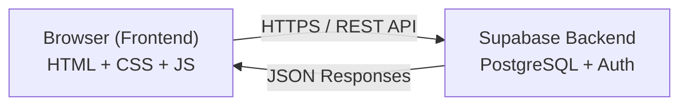
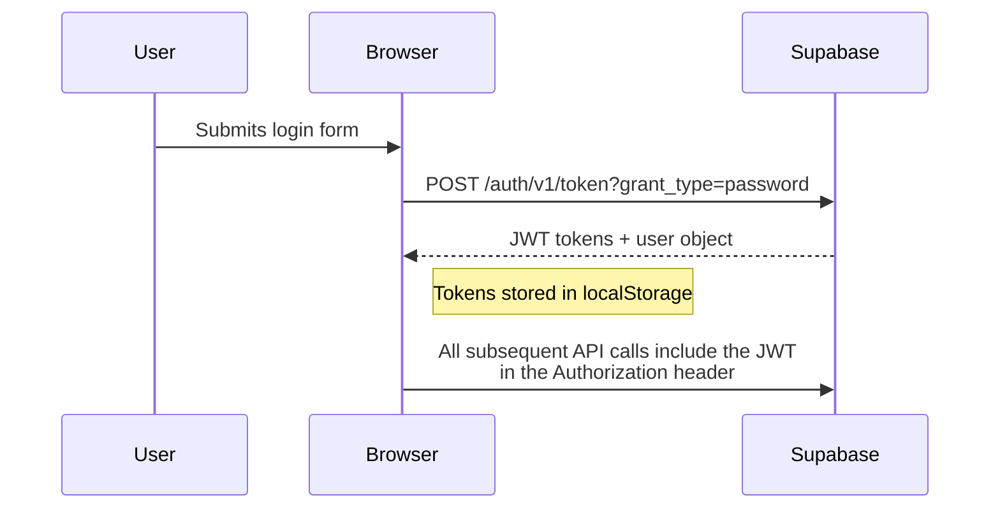
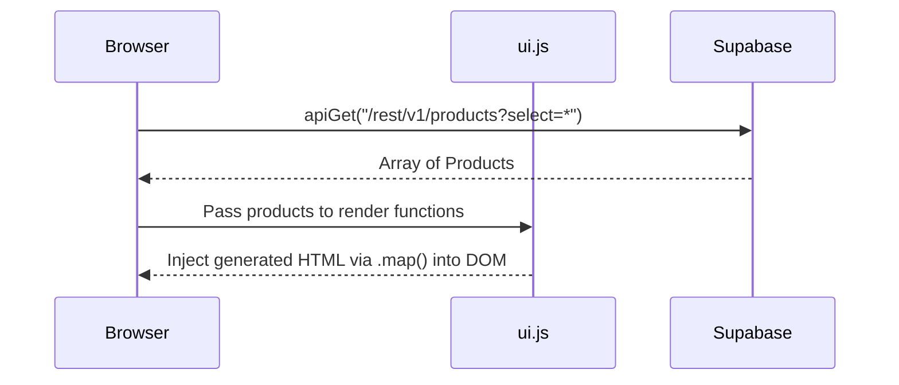
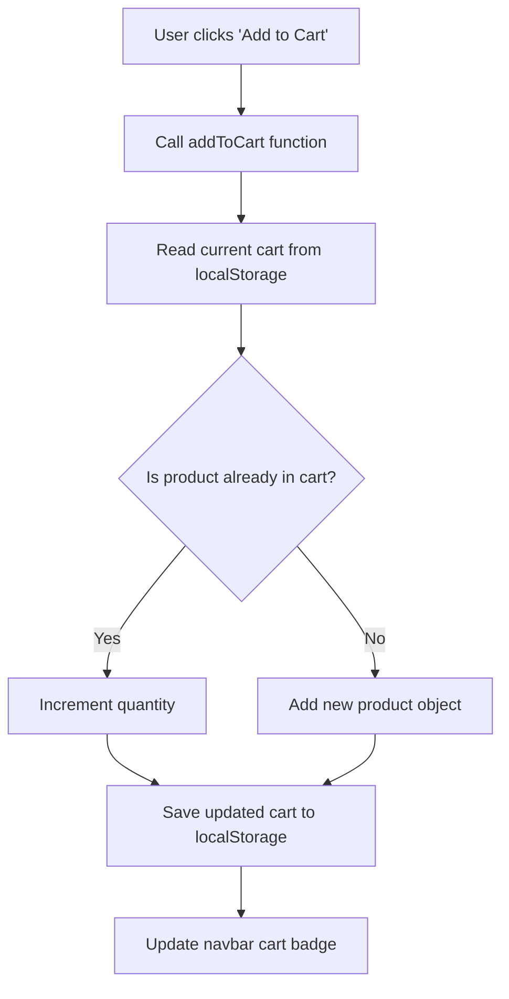
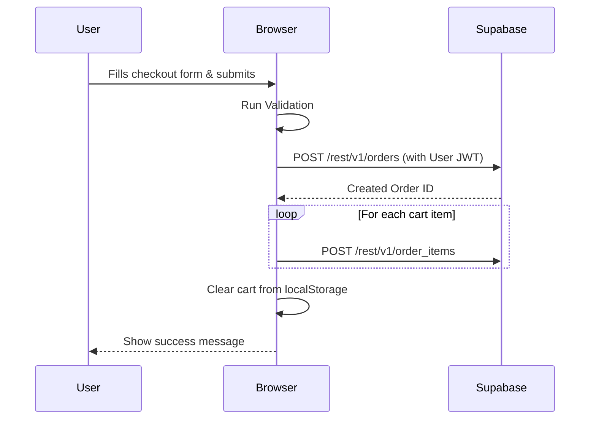
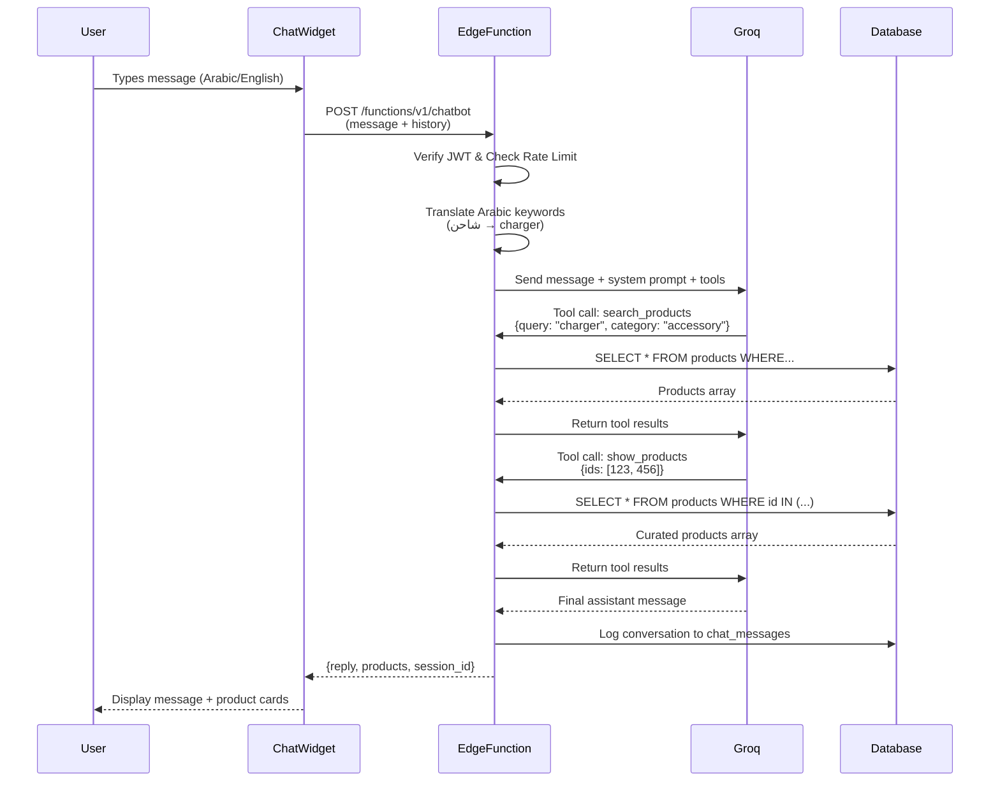
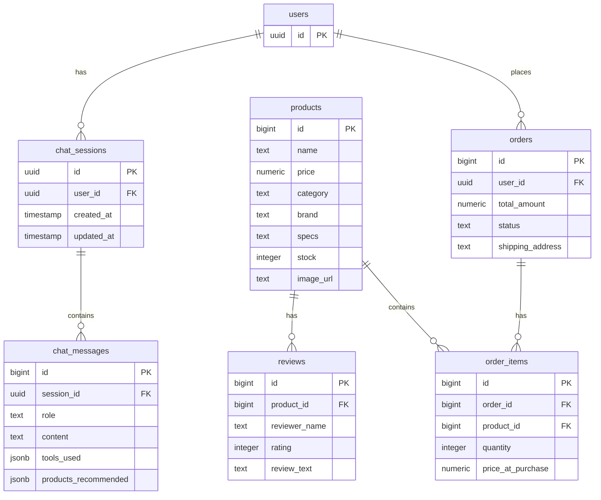

# Architecture

An overview of how byteStore is built, how the pieces connect, and how data flows through the application.

---

## How It Works (The Big Picture)



**byteStore is a client-side application.** All the code runs in the user's browser. There is no custom server — the app talks directly to Supabase's REST API using the browser's built-in `fetch()` function.

This means:

- **No build step** — open `index.html` and it works
- **No Node.js server** — Supabase handles the database and authentication
- **No frontend framework** — everything is vanilla HTML, CSS, and JavaScript

---

## Tech Stack Breakdown

| Layer              | Technology                | Role                                                   |
| ------------------ | ------------------------- | ------------------------------------------------------ |
| **Structure**      | HTML5                     | Page layout and semantic content                       |
| **Styling**        | Tailwind CSS (CDN)        | Utility classes for layout, spacing, responsive design |
| **Components**     | Franken UI                | Pre-styled UI elements (buttons, cards, modals, etc.)  |
| **Icons**          | Lucide Icons              | SVG icon library                                       |
| **Logic**          | Vanilla JavaScript (ES6+) | All interactivity, API calls, DOM updates              |
| **Database**       | Supabase (PostgreSQL)     | Product catalog, orders, reviews                       |
| **Auth**           | Supabase Auth             | User registration and login                            |
| **Storage**        | Supabase Storage          | Product images uploaded by admin                       |
| **Client Storage** | localStorage              | Cart data and user session tokens                      |

---

## JavaScript Modules

The app's logic is split into focused files, each handling one concern:

### `js/api.js` — API Layer

The foundation of all backend communication. Provides generic `apiGet()`, `apiPost()`, `apiPatch()`, and `apiDelete()` functions that wrap `fetch()` with the proper Supabase headers (API key, auth token). Every other module uses these functions to talk to the backend.

### `js/auth.js` — Authentication

Handles user login, registration, and logout. On successful login, the JWT access token and user object are stored in `localStorage`. Also includes admin access control — checking if the logged-in user has admin privileges by inspecting the JWT payload.

### `js/cart.js` — Cart Management

The cart lives entirely in the browser's `localStorage`. This module provides functions to add/remove items, update quantities, calculate totals, and enforce stock limits. No server calls are needed for cart operations.

### `js/ui.js` — UI Rendering

Contains functions that build HTML dynamically and inject it into the page. This includes rendering product cards, product detail views, the navbar (with auth-aware states), toasts, and scroll animations using `IntersectionObserver`.

### `js/router.js` — URL Handling

A small utility that reads URL query parameters. Used by the product detail page to know which product to display (e.g., `product.html?id=42`).

### `js/admin.js` — Admin Dashboard

Powers the admin page with product CRUD operations and image uploads to Supabase Storage.

### `js/chatbot.js` — AI Shopping Assistant

Implements the floating chat widget UI and manages conversation state. Handles:

- Injecting the chat button and window into the DOM
- Sending user messages to the Supabase Edge Function
- Rendering AI responses with markdown support
- Displaying product recommendation cards
- Storing conversation history in `localStorage`
- Managing rate limit error messages

---

## Supabase Edge Function — Chatbot Backend

While the main app is entirely client-side, the AI chatbot requires server-side logic to securely communicate with Groq's API. This is implemented as a **Supabase Edge Function** (Deno-based serverless function).

### Why an Edge Function?

- **API Key Security:** The Groq API key must never be exposed to the browser
- **Rate Limiting:** Server-side enforcement prevents abuse (20 messages per 10 minutes per user)
- **Database Access:** Direct access to products table with service role privileges
- **Tool Execution:** The LLM can call functions that query the database in real-time

### Architecture

```typescript
supabase / functions / chatbot / index.ts;
```

The Edge Function:

1. **Authenticates** the user via JWT token validation
2. **Rate limits** requests using a PostgreSQL RPC function
3. **Expands queries** by translating Arabic keywords to English
4. **Calls Groq API** with the user's message, conversation history, and tool definitions
5. **Executes tools** when the LLM requests them:
   - `search_products` — Queries the products table with filters
   - `get_price_range` — Returns price statistics for categories
   - `show_products` — Fetches specific products by ID for display
6. **Logs conversations** to `chat_sessions` and `chat_messages` tables
7. **Returns** the AI's reply and product recommendations to the client

### Query Translation Layer

The function includes a `QUERY_SYNONYMS` dictionary that maps common Arabic tech terms to English:

```typescript
const QUERY_SYNONYMS = {
  شاحن: "charger",
  كيبورد: "keyboard",
  سماعة: "headphone",
  لاسلكي: "wireless",
  // ... 30+ mappings
};
```

When a user searches for "شاحن سريع" (fast charger), the function:

1. Splits into words: ["شاحن", "سريع"]
2. Translates each: ["charger", "fast"]
3. Searches products for entries containing either word

This enables natural bilingual search without requiring English keywords in the database.

### Tool Definitions (Function Calling)

The Edge Function defines three tools that the LLM can call:

**search_products** — Main product search tool

```typescript
{
  query: string,          // Free text search
  category: "laptop" | "phone" | "audio" | "accessory",
  brand: string,          // Partial match
  min_price: number,
  max_price: number,
  sort: "price_asc" | "price_desc"
}
```

**get_price_range** — Price statistics

```typescript
{
  category?: string  // Optional category filter
}
// Returns: { min_price, max_price, total_count, category }
```

**show_products** — Display specific products

```typescript
{
  ids: string[]  // Array of product IDs (max 5)
}
```

The LLM decides when to call these tools based on the user's request and the system prompt instructions.

### Rate Limiting Implementation

Rate limiting is enforced at the database level via an SQL RPC function:

```sql
check_and_increment_chat_rate_limit(
  p_user_id uuid,
  p_window_seconds int,
  p_max_count int
)
```

This function:

- Checks the `chatbot_rate_limits` table for recent requests
- Counts messages within the time window
- Returns `allowed: false` if the limit is exceeded
- Updates the request count atomically

**Benefits:**

- No external Redis or memory cache needed
- Works across multiple Edge Function instances
- Automatically cleans up old records

### Deployment

```bash
# Set secrets
supabase secrets set GROQ_API_KEY=your_key
supabase secrets set GROQ_MODEL=openai/gpt-oss-120b

# Deploy
supabase functions deploy chatbot
```

The function is accessible at:

```
https://<project-ref>.supabase.co/functions/v1/chatbot
```

---

## Authentication Flow



**Key design decision:** The app does NOT use the Supabase JavaScript SDK. All auth is done through raw `fetch()` calls to Supabase's REST endpoints. This was an academic requirement to demonstrate proficiency with the Fetch API.

---

## Data Flow

### Browsing Products



### Adding to Cart



### Placing an Order



### Chatbot Conversation



---

## Database Overview

The app uses the following tables in Supabase (PostgreSQL):



**Row Level Security (RLS)** is enabled:

- Products and reviews are publicly readable
- Users can only view and create their own orders
- Users can only view their own chat sessions and messages
- Chatbot rate limiting is enforced at the database level via RPC function

---

## Folder Structure

```
byteStore/
├── assets/            # Images, SVG logos, brand assets
├── css/
│   └── style.css      # Custom styles, animations, Tailwind overrides
├── docs/              # This documentation
├── js/
│   ├── api.js         # Supabase REST API wrappers
│   ├── auth.js        # Authentication & admin access
│   ├── cart.js        # localStorage cart logic
│   ├── chatbot.js     # AI shopping assistant widget
│   ├── admin.js       # Admin dashboard logic
│   ├── ui.js          # DOM rendering & UI components
│   └── router.js      # URL query parameter helpers
├── supabase/
│   ├── functions/
│   │   └── chatbot/   # Edge Function for AI chatbot
│   └── migrations/    # Database schema and setup
├── database_prep/     # Product data seed files
├── *.html             # 11 pages (index, shop, product, cart, etc.)
└── README.md          # Project overview
```
