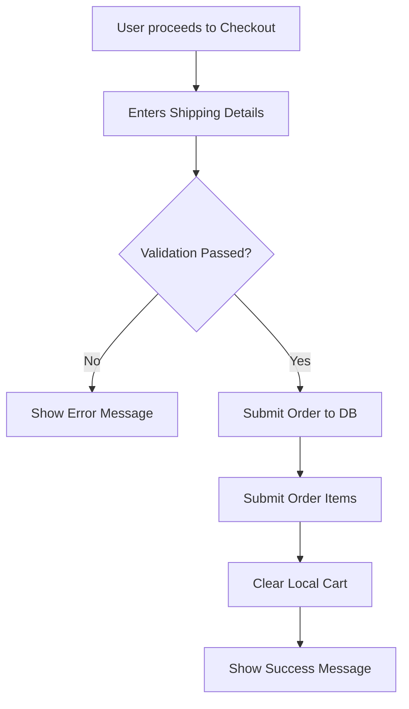

# Features

A detailed breakdown of everything byteStore can do.

---

## Product Browsing

The shop page displays all products in a responsive card grid. Each card shows the product image, name, category, price, and an "Add to Cart" button.

- **Categories:** Laptops, Phones, Audio, Accessories
- **128+ products** with real names, descriptions, and prices
- **Product detail page** shows full description, a specifications table (rendered from Markdown), and customer reviews

---

## Search & Filtering

The shop page provides multiple ways to find products:

- **Search bar** — searches product names in real-time (available in both desktop navbar and mobile menu)
- **Category filter** — dropdown to filter by product category
- **Brand filter** — dynamically populated dropdown based on available brands
- **Price range** — min/max price inputs to narrow down results
- All filters work together and update the product grid instantly

---

## Shopping Cart

The cart is stored entirely in the browser using `localStorage` — no account needed to start shopping.

- **Add to cart** from any product card or the product detail page
- **Quantity controls** — increment/decrement buttons on the cart page
- **Stock enforcement** — prevents adding more units than available stock
- **Live totals** — cart total updates as quantities change
- **Cart badge** — navbar shows the current item count
- **Persistent** — cart survives page refreshes and navigation

---

## Checkout

The checkout page collects shipping information and places the order.

- **Form fields:** Full name, email, phone number, address, city, and governorate
- **Validation:**
  - All fields required
  - Phone must be exactly 11 digits with a valid Egyptian prefix (010, 011, 012, 015)
  - Email format validation
- **Order placement:** creates an order and order items in the database via REST API
- **Order confirmation:** success message with order details

---

## User Accounts

Users can create accounts and log in to access protected features.

- **Registration** — email and password (minimum 8 characters)
- **Login** — authenticates via Supabase Auth REST API
- **Session persistence** — JWT tokens stored in `localStorage`; user stays logged in across page refreshes
- **Profile page** — displays user info and order history
- **Protected pages** — checkout and profile require authentication; unauthenticated users are redirected to login

---

## Admin Dashboard

A restricted page for managing the product catalog (accessible only to the designated admin email).

- **Product table** — view all products with sortable columns
- **Add products** — form to create new products with all fields
- **Edit products** — inline editing of existing product details
- **Delete products** — confirmation modal before deletion
- **Image upload** — upload product images directly to Supabase Storage

---

## Dark Mode

The app supports light and dark themes using Franken UI's theme system.

- **Theme switcher** in the navbar (sun/moon toggle)
- **Consistent styling** — all components, cards, and backgrounds adapt to the selected theme
- **Product images** — card image areas maintain a white background in dark mode for visual clarity
- **Persisted preference** — theme choice is remembered across sessions

---

## Responsive Design

Every page is fully responsive:

- **Mobile navbar** — collapses into a burger menu with smooth slide-down animation
- **Product grid** — adapts from 4 columns on desktop to 1 column on mobile
- **Touch-friendly** — buttons and interactive elements are sized for touch
- **Mobile toast notifications** — positioned at the bottom of the screen to avoid blocking the navbar

---

## Animations & Visual Polish

- **Page load fade-in** — smooth entrance animation on every page
- **Scroll-triggered animations** — product cards and sections animate in as you scroll (using `IntersectionObserver`)
- **Hover effects** — cards lift with shadow on hover, buttons scale subtly
- **Brand carousel** — auto-scrolling logo strip on the homepage with grayscale-to-color hover effect
- **Loading states** — spinner animations during form submissions and data fetches
